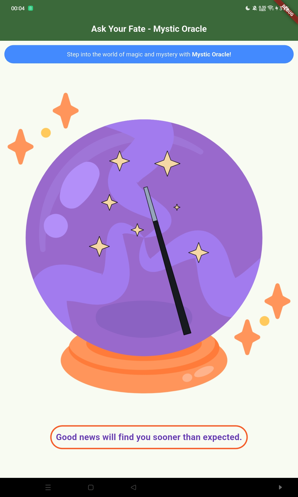
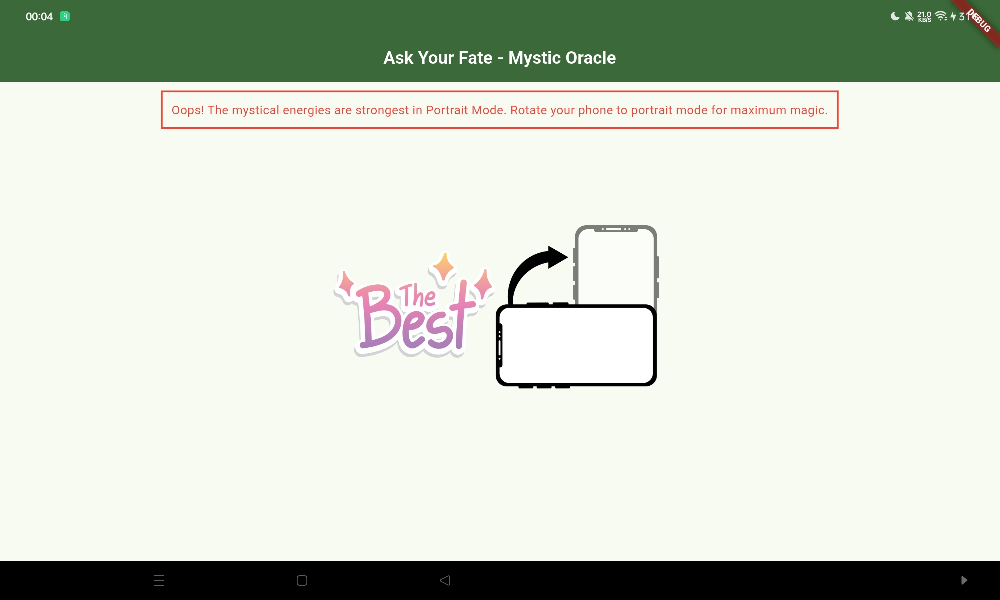

# Mystic Oracle

**Mystic Oracle** is a magical Flutter application that reveals mysterious fortunes and predictions. Ask your question, tap the mystical oracle, and uncover what destiny has in store for you!

---

## Features

* 🔮 Random fortune generation
* 🎲 25 unique mystical predictions
* ✨ Interactive oracle ball with tap animation
* 📱 Responsive orientation handling
* 🎨 Beautiful and colorful user interface
* ⚡ Smooth button press animations
* 🌌 Mystical and engaging theme
* 📲 Cross-platform Flutter support

---

## Getting Started

### Prerequisites

Ensure you have the following installed:

* Flutter SDK
* Dart SDK
* Android Studio or VS Code
* Android Emulator or Physical Device

---
## Screenshots




---

### Installation

1. Clone the repository:

```bash
git clone https://github.com/notakm/flutter-mystic-oracle.git
```

2. Navigate to the project directory:

```bash
cd flutter-mystic-oracle
```

3. Install dependencies:

```bash
flutter pub get
```

4. Run the application:

```bash
flutter run
```

---

## How to Use

1. Launch the application.
2. Read the mystical introduction.
3. Tap on the Oracle Ball.
4. Receive a magical fortune instantly.
5. Tap again to reveal a new prediction.

---

## Orientation Support

Mystic Oracle is designed primarily for **Portrait Mode**.

When the device is rotated to landscape mode, users are informed that the mystical experience is best enjoyed in portrait orientation.

---

## Sample Fortunes

* *"A pleasant surprise awaits you today."*
* *"Trust your instincts—they will guide you well."*
* *"Fortune favors the bold. Take the first step."*
* *"Unexpected joy is heading your way."*
* *"The universe is aligning in your favor."*

---

## Built With

* **Flutter** – Cross-platform UI toolkit
* **Dart** – Programming language for Flutter
* **Material Design** – UI Components and Styling

---

## 📂 Project Structure

```text
lib/
└── main.dart

assets/
└── images/
    ├── logo.png
    └── landscapemode.png
```

---

## Contributing

Contributions, suggestions, and improvements are welcome.

1. Fork the repository.
2. Create a feature branch.
3. Commit your changes.
4. Push to your branch.
5. Open a Pull Request.

---

## Author

**Akshad Kavin Mars**

GitHub: https://github.com/notakm

---

## ⭐ Support

If you enjoyed this project, please consider giving it a ⭐ on GitHub. Your support is greatly appreciated!

---

*"Ask your question and let the Mystic Oracle reveal your destiny."* 🔮
